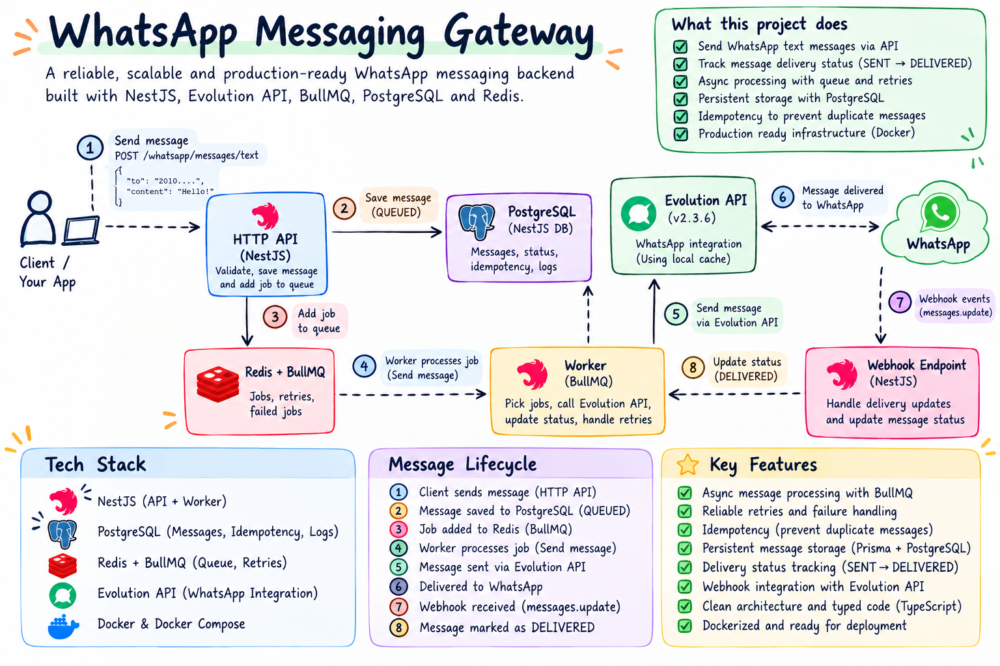

# WhatsApp Gateway

A reliable outbound WhatsApp messaging gateway built with **NestJS, BullMQ, Redis, PostgreSQL, Prisma, Evolution API, and Docker**.

It provides backend applications with a centralized way to send WhatsApp messages without coupling business logic directly to a WhatsApp provider.

The gateway handles persistence, asynchronous processing, retries, idempotency, failure recovery, and delivery tracking.

<p align="center">
  
</p>

---

## Why This Gateway Exists

Sending a WhatsApp message is easy.

Building a system that behaves correctly when providers fail, requests are duplicated, jobs are retried, Redis becomes unavailable, and delivery events arrive asynchronously is a different problem.

A direct integration usually looks like this:

```text
Application
    |
    v
WhatsApp Provider
    |
    v
WhatsApp
```

This creates several problems.

What happens if the provider is temporarily unavailable?

What happens if the client retries the same request?

What happens if the application receives a timeout but the message was already accepted?

How do we distinguish between a message that was submitted to the provider and one that was actually delivered?

This gateway introduces a reliability layer between applications and the WhatsApp provider.

```text
Application
    |
    v
WhatsApp Gateway
    |
    +-- Persistence
    +-- Idempotency
    +-- Queueing
    +-- Retries
    +-- Failure Handling
    +-- Provider Isolation
    +-- Delivery Tracking
    |
    v
Evolution API
    |
    v
WhatsApp
```

---

# Use Cases

The gateway is designed for systems that need reliable programmatic WhatsApp delivery without embedding WhatsApp-specific logic inside every service.

## Transactional Notifications

Send messages triggered by application events such as:

- Order confirmations
- Payment notifications
- Shipping updates
- Booking confirmations
- Account notifications
- Workflow status updates

The originating application only needs to communicate with the gateway.

---

## Authentication Messages

Authentication systems can submit messages such as OTP or account-related notifications without directly depending on the WhatsApp provider.

```text
Auth Service
     |
     v
WhatsApp Gateway
     |
     v
WhatsApp
```

The gateway takes responsibility for queueing and processing the message.

---

## Background Notifications

Long-running processes can enqueue WhatsApp notifications without blocking their main workflow.

Examples include:

- Report completion
- Background job completion
- Import/export completion
- Processing status updates

---

## Centralized Messaging for Microservices

Instead of allowing every service to integrate independently with Evolution API:

```text
Auth ---------> Evolution
Orders -------> Evolution
Payments -----> Evolution
Shipping -----> Evolution
```

services can use one messaging gateway:

```text
Auth -----------+
Orders ---------+
Payments -------+----> WhatsApp Gateway ----> Evolution ----> WhatsApp
Shipping -------+
```

This centralizes:

- Provider credentials
- Retry behavior
- Message persistence
- Idempotency
- Queue management
- Delivery tracking

---

## Retry-Safe Client Integrations

Network failures sometimes leave clients unable to determine whether a request succeeded.

Clients can safely retry a message request using the same:

```http
Idempotency-Key
```

The gateway resolves repeated requests to the same persisted message instead of intentionally creating another delivery.

---

# Architecture

The gateway uses asynchronous message processing.

```text
                         +----------------+
                         |     Client     |
                         +-------+--------+
                                 |
                                 | HTTP
                                 v
                      +----------+----------+
                      |       NestJS        |
                      |        API          |
                      +----------+----------+
                                 |
                                 v
                      +----------+----------+
                      |     PostgreSQL      |
                      |  Source of Truth    |
                      +----------+----------+
                                 |
                                 | Message ID
                                 v
                      +----------+----------+
                      |       BullMQ        |
                      |       Redis         |
                      +----------+----------+
                                 |
                                 v
                      +----------+----------+
                      |       Worker        |
                      +----------+----------+
                                 |
                                 v
                      +----------+----------+
                      |    Evolution API    |
                      +----------+----------+
                                 |
                                 v
                      +----------+----------+
                      |      WhatsApp       |
                      +----------+----------+
                                 |
                                 | Delivery Events
                                 v
                      +----------+----------+
                      | Evolution Webhooks  |
                      +----------+----------+
                                 |
                                 v
                      +----------+----------+
                      |      NestJS         |
                      +----------+----------+
                                 |
                                 v
                      +----------+----------+
                      |     PostgreSQL      |
                      +---------------------+
```

---

# Message Flow

## 1. Request

The client submits a WhatsApp message to the gateway.

```text
POST /whatsapp/messages/text
```

The request contains:

```json
{
  "number": "201XXXXXXXXX",
  "text": "Your order has been confirmed"
}
```

An idempotency key can be provided through the request headers.

---

## 2. Validation

The gateway validates the request using Zod before accepting it for processing.

Invalid requests are rejected before reaching the messaging workflow.

---

## 3. Persistence

The outbound message is persisted in PostgreSQL.

PostgreSQL acts as the source of truth for message state.

The queue is not used as the permanent message store.

---

## 4. Queueing

The gateway creates a BullMQ job.

Instead of copying the complete message payload into Redis, the job references the persisted message:

```text
{
  messageId
}
```

The worker can then retrieve the latest message state from PostgreSQL.

---

## 5. Processing

A BullMQ worker receives the job and transitions the message into:

```text
PROCESSING
```

It then loads the message from PostgreSQL and calls the configured WhatsApp provider.

---

## 6. Provider Delivery

The Evolution provider sends the message through Evolution API.

After Evolution successfully accepts the message, its provider message ID is persisted and the internal message becomes:

```text
SENT
```

---

## 7. Delivery Webhook

WhatsApp delivery events are received through Evolution webhooks.

For an outbound delivery acknowledgement, Evolution sends a:

```text
messages.update
```

event containing:

```text
DELIVERY_ACK
```

The gateway uses the provider message ID to locate the original message.

---

## 8. Delivery Confirmation

The message is transitioned to:

```text
DELIVERED
```

and its:

```text
deliveredAt
```

timestamp is persisted.

---

# Message Lifecycle

The main outbound lifecycle is:

```text
PENDING
   |
   v
QUEUED
   |
   v
PROCESSING
   |
   v
SENT
   |
   v
DELIVERED
```

Failed processing can transition a message into:

```text
FAILED
```

The distinction between `SENT` and `DELIVERED` is intentional.

`SENT` means the provider successfully accepted the message.

`DELIVERED` means a delivery acknowledgement was later received through the webhook flow.

---

# Reliability Model

## PostgreSQL as the Source of Truth

Message state is persisted in PostgreSQL.

Redis and BullMQ are responsible for asynchronous execution, while PostgreSQL remains responsible for the durable message record.

This allows message state to exist independently from the lifecycle of a queue job.

---

## Asynchronous Processing

The client does not need to wait for the WhatsApp provider to finish the delivery process.

```text
HTTP Request
     |
     v
Persist Message
     |
     v
Queue Job
     |
     +------> API can respond
     |
     v
Background Worker
     |
     v
Provider
```

Provider latency is therefore separated from the main HTTP request lifecycle.

---

# Retry Strategy

Temporary provider failures should not immediately cause a message to be lost.

Jobs are configured with multiple attempts and exponential backoff.

Conceptually:

```text
Attempt 1
   |
   X
   |
   v
Wait
   |
   v
Attempt 2
   |
   X
   |
   v
Longer Wait
   |
   v
Attempt 3
```

The current queue configuration uses:

```text
Attempts: 6
Backoff: Exponential
Initial delay: 5000 ms
```

If Evolution becomes available during the retry window, a later attempt can continue processing the message.

If all configured attempts are exhausted, the message is marked:

```text
FAILED
```

---

# Idempotency

Distributed systems cannot assume that an HTTP request will only be sent once.

A client may send a request successfully but fail to receive the response.

It may then retry the same operation.

Without idempotency:

```text
Request
   |
   +---- Retry
   |
   v
Message A

Retry
   |
   v
Message B

Result: duplicate WhatsApp messages
```

The gateway supports:

```http
Idempotency-Key
```

The key is persisted with the message and protected by a PostgreSQL unique constraint.

```text
Request A
key: order-123
      |
      +----------------+
      |                |
      v                v
 Request B         Request C
 order-123         order-123
      |                |
      +-------+--------+
              |
              v
      PostgreSQL UNIQUE
              |
              v
         One Message
              |
              v
           One Job
```

Concurrent requests using the same key are also handled so a uniqueness race does not result in multiple persisted messages.

---

# Failure Handling

A major goal of the project is predictable behavior when dependencies become unavailable.

## Evolution API Unavailable

```text
Worker
  |
  v
Evolution API
  |
  X
  |
  v
Job Failure
  |
  v
BullMQ Retry
  |
  v
Exponential Backoff
  |
  v
Evolution Recovers
  |
  v
Next Attempt
  |
  v
SENT
```

This scenario was tested by stopping Evolution during processing and restoring it while retries were still active.

A later retry successfully completed the delivery.

---

## Redis Unavailable

The gateway does not report a message as successfully queued when the queue infrastructure is unavailable.

```text
API
 |
 v
Queue Availability Check
 |
 X
 |
 v
503 QUEUE_UNAVAILABLE
```

After Redis becomes available again, queue operations can recover without requiring the NestJS application to be restarted.

---

## Duplicate Requests

Repeated requests using the same idempotency key resolve to the same persisted message.

This behavior was also tested with concurrent requests.

---

## Worker Failure

If processing continues to fail until all configured attempts are exhausted, the message is persisted as:

```text
FAILED
```

with failure information stored alongside the message.

---

# Delivery Semantics

A successful HTTP request does **not** mean that WhatsApp has delivered the message.

There are multiple levels of success.

### Accepted

The gateway has accepted the request for processing.

### Queued

The message has been persisted and scheduled for background processing.

### Sent

Evolution successfully accepted the provider request.

### Delivered

WhatsApp delivery was confirmed through the Evolution webhook.

Applications can inspect the current state instead of treating the initial API response as proof of delivery.

---

# Provider Abstraction

The business logic does not depend directly on Evolution API.

Providers implement a common interface:

```ts
export interface WhatsAppProvider {
  sendText(
    number: string,
    text: string,
  ): Promise<ProviderSendTextResult>;
}
```

The application depends on:

```text
WhatsAppProvider
```

rather than:

```text
EvolutionClient
```

Conceptually:

```text
                  +-------------------+
                  | WhatsApp Service  |
                  +---------+---------+
                            |
                            v
                  +-------------------+
                  | WhatsAppProvider  |
                  +---------+---------+
                            |
              +-------------+-------------+
              |                           |
              v                           v
      EvolutionProvider           Another Provider
```

Evolution-specific HTTP communication and response mapping remain isolated from the core messaging workflow.

---

# Webhooks

Evolution sends provider events to:

```http
POST /webhooks/evolution
```

The current tested outbound implementation handles delivery updates.

```text
WhatsApp
   |
   v
Evolution
   |
   | messages.update
   | DELIVERY_ACK
   v
Webhook Controller
   |
   v
Webhook Service
   |
   | providerMessageId
   v
PostgreSQL
   |
   v
DELIVERED
```

Webhook payloads should not be logged in full because they may contain message content, phone information, provider credentials, or other sensitive information.

---

# Data Model

Messages are persisted independently from BullMQ jobs.

A message contains information such as:

```text
id
providerMessageId
idempotencyKey
recipient
content
direction
status
errorCode
errorMessage
sentAt
deliveredAt
readAt
failedAt
createdAt
updatedAt
```

Important uniqueness guarantees include:

```text
providerMessageId  UNIQUE
idempotencyKey     UNIQUE
```

The provider ID connects asynchronous provider events back to the internal message.

---

# API Reference

## Send Text Message

```http
POST /whatsapp/messages/text
```

### Headers

```http
Content-Type: application/json
Idempotency-Key: order-confirmation-123
```

### Body

```json
{
  "number": "201XXXXXXXXX",
  "text": "Your order has been confirmed"
}
```

### Example

```bash
curl -X POST http://localhost:3000/whatsapp/messages/text \
  -H "Content-Type: application/json" \
  -H "Idempotency-Key: order-confirmation-123" \
  -d '{
    "number": "201XXXXXXXXX",
    "text": "Your order has been confirmed"
  }'
```

---

## Get Message

```http
GET /whatsapp/messages/:id
```

Example:

```bash
curl http://localhost:3000/whatsapp/messages/<MESSAGE_ID>
```

A delivered message can look like:

```json
{
  "id": "48845e1b-5037-4f62-b5c6-15263ca27753",
  "providerMessageId": "provider-message-id",
  "idempotencyKey": "order-confirmation-123",
  "recipient": "201XXXXXXXXX",
  "content": "Your order has been confirmed",
  "direction": "OUTBOUND",
  "status": "DELIVERED",
  "errorCode": null,
  "errorMessage": null,
  "sentAt": "2026-09-29T15:20:44.390Z",
  "deliveredAt": "2026-09-29T15:20:46.278Z",
  "readAt": null,
  "failedAt": null
}
```

---

# Error Behavior

The gateway exposes explicit failure behavior instead of silently accepting operations that cannot be processed.

For example, when queue infrastructure is unavailable:

```json
{
  "code": "QUEUE_UNAVAILABLE",
  "message": "Message queue is currently unavailable"
}
```

Validation failures are also rejected before entering the messaging workflow.

---

# Infrastructure

The local environment is fully containerized.

```text
Docker Compose
|
+-- Gateway PostgreSQL
|
+-- Redis
|
+-- Evolution PostgreSQL
|
+-- Evolution API
```

The NestJS application connects to these services while developing locally.

Redis database separation is used so the gateway queue and Evolution cache do not share the same logical Redis database.

---

# Tech Stack

| Technology | Responsibility |
|---|---|
| NestJS | API and application architecture |
| TypeScript | Static typing |
| PostgreSQL | Durable message persistence |
| Prisma | Database access and migrations |
| BullMQ | Background job processing |
| Redis | Queue infrastructure |
| Evolution API | WhatsApp integration |
| Zod | Runtime validation |
| Docker | Infrastructure |

---

# Configuration

The application uses environment-based configuration.

Example:

```env
NODE_ENV=development
PORT=3000

DATABASE_URL=

POSTGRES_USER=
POSTGRES_PASSWORD=
POSTGRES_DB=
POSTGRES_PORT=5433

REDIS_HOST=localhost
REDIS_PORT=6379
REDIS_DB=0

EVOLUTION_DB_USER=
EVOLUTION_DB_PASSWORD=
EVOLUTION_DB_NAME=
EVOLUTION_DB_PORT=5434

EVOLUTION_PORT=8080
EVOLUTION_API_KEY=
EVOLUTION_API_URL=http://localhost:8080
EVOLUTION_INSTANCE=whatsapp-main
EVOLUTION_REQUEST_TIMEOUT=10000
```

Configuration is validated during application startup.

Never commit real secrets or the `.env` file.

---

# Running Locally

## Prerequisites

You need:

- Node.js
- npm
- Docker
- Docker Compose

---

## 1. Clone

```bash
git clone <repository-url>
cd whatsapp-gateway
```

---

## 2. Install Dependencies

```bash
npm install
```

---

## 3. Configure Environment

```bash
cp .env.example .env
```

Then provide the required local values.

---

## 4. Start Infrastructure

```bash
docker compose up -d
```

Check the containers:

```bash
docker compose ps
```

---

## 5. Run Database Migrations

```bash
npx prisma migrate deploy
```

---

## 6. Start NestJS

```bash
npm run start:dev
```

The API runs on:

```text
http://localhost:3000
```

unless another port is configured.

---

# Health Checks

Database connectivity can be checked through:

```http
GET /health/db
```

The endpoint verifies that the application can communicate with PostgreSQL.

Example response:

```json
{
  "status": "ok",
  "database": "connected"
}
```

---

# Operational Behavior

## Queue Concurrency

The current worker processes multiple jobs concurrently.

Current worker concurrency:

```text
5
```

This prevents all queued messages from being processed serially while still placing a bound on concurrent provider operations.

---

## Queue Retention

Completed and failed jobs are retained using bounded BullMQ cleanup policies rather than being stored forever.

This keeps Redis from growing indefinitely because of historical queue metadata.

PostgreSQL remains the durable source of message information.

---

## Graceful Resource Cleanup

Long-lived infrastructure clients should be closed when their owning application components are destroyed.

The project closes resources such as Prisma and queue connections during application shutdown where implemented.

---

# Security Considerations

The gateway deals with provider credentials and potentially sensitive message data.

Important rules include:

- Never commit `.env`
- Never expose the Evolution API key
- Never log complete webhook payloads in production
- Never log provider authorization headers
- Validate external input
- Keep provider credentials inside the gateway
- Do not expose PostgreSQL or Redis publicly in production
- Use HTTPS when exposing the API publicly
- Rotate credentials if they are accidentally exposed

Phone numbers and message content should be treated as sensitive application data.

---

# Failure Scenarios Tested

The implementation was manually tested against several non-happy-path scenarios.

| Scenario | Observed Behavior |
|---|---|
| Normal message | Message reaches WhatsApp |
| Evolution unavailable | BullMQ retries the job |
| Evolution restored during retry window | Later attempt succeeds |
| Retry limit exhausted | Message becomes `FAILED` |
| Same idempotency key reused | Existing message is returned |
| Concurrent requests with same key | One persisted message is used |
| Redis unavailable | API returns queue unavailable |
| Redis restored | Queueing works without NestJS restart |
| Provider accepts message | Message becomes `SENT` |
| Delivery acknowledgement received | Message becomes `DELIVERED` |

Testing failure scenarios was an intentional part of the project rather than only testing the happy path.

---

# Current Scope

The current tested scope is:

> Reliable outbound WhatsApp text messaging

Implemented and tested:

```text
Text Message Submission
        |
        v
Persistence
        |
        v
Idempotency
        |
        v
Async Queue
        |
        v
Worker Processing
        |
        v
Retries
        |
        v
Provider Submission
        |
        v
SENT
        |
        v
Delivery Webhook
        |
        v
DELIVERED
```

The repository does not currently claim tested support for:

- Incoming message processing
- Read receipt tracking
- Media messages
- Multi-instance routing

These capabilities can be added on top of the existing architecture without changing the core outbound flow.

---

# Production Considerations

The gateway uses production-oriented backend patterns, but deploying any messaging infrastructure requires environment-specific operational decisions.

Before using it in a real production environment, consider:

### HTTPS

Expose public API and webhook endpoints only through HTTPS.

### Network Isolation

PostgreSQL and Redis should remain on private networks and should not be directly exposed to the internet.

### Authentication

Add service-to-service authentication in front of the public gateway API when multiple applications use it.

### Webhook Protection

Protect webhook endpoints using provider-supported authentication or a trusted shared-secret mechanism.

### Observability

Production deployments should add centralized:

- Logging
- Metrics
- Alerting
- Queue monitoring

### Rate Limiting

Provider and WhatsApp throughput limits should be reflected in worker concurrency and application-level rate limits.

### Backups

PostgreSQL should use a regular backup and recovery strategy.

### Horizontal Scaling

Multiple workers require careful consideration of provider throughput, idempotency, and distributed processing behavior.

### Transactional Outbox

For stronger guarantees between database persistence and queue publication, a transactional outbox can be introduced.

The current implementation handles the tested outbound workflow but does not claim exactly-once delivery semantics.

---

# Delivery Guarantees

The system intentionally does **not** claim exactly-once message delivery.

Exactly-once behavior cannot generally be guaranteed across an external provider and network boundaries.

Instead, the design combines:

```text
Persistent State
      +
Idempotent Requests
      +
Durable Queueing
      +
Retries
      +
Provider Message IDs
      +
Delivery Events
```

to provide predictable and observable message processing behavior.

---

# Design Decisions

Several implementation choices were intentional.

### Why PostgreSQL and not Redis for message state?

Redis is used for job processing.

PostgreSQL is used as the durable source of truth.

---

### Why store only the message ID in BullMQ?

It prevents Redis from becoming another copy of the application database and allows workers to retrieve the latest persisted state before processing.

---

### Why process messages asynchronously?

WhatsApp provider latency and availability should not directly control the client HTTP request lifecycle.

---

### Why use idempotency keys?

Clients retry requests.

Without idempotency, a network retry can become a duplicate WhatsApp message.

---

### Why use a provider abstraction?

The gateway should own messaging behavior.

Evolution should remain an implementation detail of the provider layer.

---

### Why distinguish SENT from DELIVERED?

Provider acceptance and recipient delivery are two different events.

The data model should represent that distinction.

---

# Project Structure

```text
src/
├── common/
│   └── pipes/
│
├── config/
│
├── generated/
│   └── prisma/
│
├── modules/
│   └── whatsapp/
│       ├── dto/
│       ├── evolution/
│       ├── providers/
│       ├── queue/
│       ├── repositories/
│       ├── webhooks/
│       ├── whatsapp.controller.ts
│       ├── whatsapp.module.ts
│       └── whatsapp.service.ts
│
└── ...

prisma/
├── migrations/
└── schema.prisma

assets/
└── whatsapp-gateway.png

docker-compose.yml
prisma.config.ts
```

---

# Engineering Takeaway

The main challenge in this project was never the WhatsApp API call itself.

The interesting part was everything around it:

```text
What if the provider goes down?

What if Redis goes down?

What if the client retries?

What if two identical requests arrive concurrently?

What if the worker has to retry?

What does SENT actually mean?

How do we know the message was DELIVERED?
```

Building around those questions turned a simple API integration into an exercise in asynchronous processing, failure recovery, idempotency, queue design, provider isolation, and message lifecycle management.

---

## License

This project is intended for learning, experimentation, and portfolio demonstration.